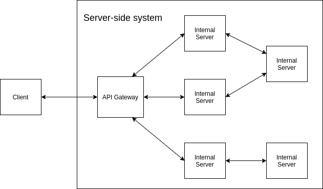
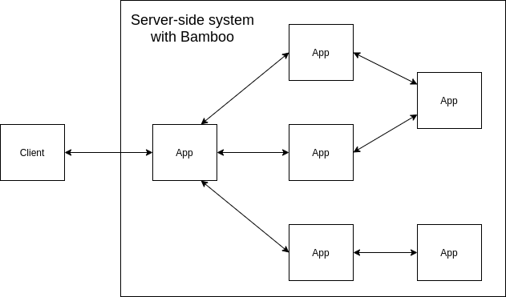
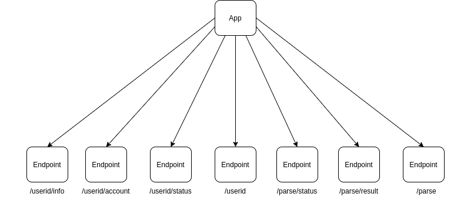

# Bamboo のコンセプト
Bamboo は **マイクロサービスを実現するためのサーバーモデルを実装** することをモチベーションとして開発されました．このドキュメントでは，複雑なサーバーシステムを実装するために導入された2つの Bamboo のコア概念について説明し，あなたがそれらをコードレベルでどのように実装できるかについて見ていきます．

## マイクロサービスによるシステムの複雑化
マイクロサービスアーキテクチャでは，サーバーサイドアプリケーションを小さなサービスを疎結合した集合体として実装されます．それを実現するために，複数のサーバーを立ててそのサーバー間で通信することが普通に起こります．つまり，ソースコードはその複数のサーバーに散りばめられ，単一のアプリケーションとして管理が難しくなると同時に全体のシステムは複雑化してしまいます．

このような複雑な問題を扱うためには統一的でシンプルなモデル化が必要です．まず，上述したようなサーバーサイドシステムを図で表してみましょう．モノリシックなシステムではサーバーが1つで構成されるのに対し，マイクロサービスによるシステムでは複数のサーバーがコネクションを持つことで全体のシステムが構成されます．



## アプリケーション
さきほどの図のようなシステムを実際に実装するのは骨が折れる作業です．苦労して実装しても，仕様変更が起こったり，サービスの拡張などにより，コードにその場しのぎの修正が加えられ，段々管理は難しくなっていくかもしれません．そのようなカオスな状態にならないためには，シンプルなモデルを導入し，それに基づき実装をする必要があります．Bamboo では上図の各サーバーに対応するモデルを**アプリケーション**と呼んでいます．つまり，1つのサーバーには必ず1つのアプリケーションがあるとします．これを図で表すと以下のようになります．



!!! Note
    Python には PEP3333 で定義されている WSGI や ASGI (PEP では提起されていない) のような Web フレームワークのためのインターフェースがあります．このインターフェースは Python のサーバーアプリケーションと Web フレームワークの間のインターフェースで，多くの Python で実装された Web フレームワークはこれらのインターフェースに準拠しています (Bamboo もその1つです) ．しかし，実はこのような Web フレームワークを使用して書かれたプログラムは単一では動作しません．動作させるためには同一のインターフェース (WSGI なら WSGI，ASGI なら ASGI) に準拠したサーバーアプリケーションが別途に必要になります (WSGI の場合，標準ライブラリでも実装が提供されています) ．つまり上記で説明した「アプリケーション」とは Bamboo におけるサーバーをモデル化する単なる概念なのであり，スタンドアローンで動作できるアプリケーションではないという点に注意してください．

## エンドポイント
エンドポイントは Bamboo におけるもう1つのコア概念の一つです．**エンドポイント**は通信の端点を表す概念で，クライアントからのリクエストが行き着く地点です．実際にクライアントが行きたい場所にしっかりと行き着くには住所のようなものが必要になります．インターネットの世界ではこれを URI (URL) という形式で指定します．すなわち，エンドポイントはこの URI と1対1で対応します．

Bamboo のアプリケーションはこのエンドポイントを管理して，クライアントを内部のエンドポイントに導く役割をします．それを表したのが以下の図です．アプリケーションは内部に複数のエンドポイントを持つことができます．また，クライアントが何らかの URI を指定しリクエストを送ると，自身の持っているエンドポイントからその URI に対応するエンドポイントを探し当てることが出来ます．



## Bamboo でのサーバーサイドシステム
ここまでで Bamboo における2つのコア概念を導入しました．このコア概念によって最初に示したマイクロサービスアーキテクチャによるサーバーサイドシステムは，以下の図のように表すことが出来ます．

!!! Note
    実際に実装する際にはあまり意識する必要はありませんが，リクエスト自体は下図のようにアプリケーションに届くという点に注意してください．厳密にはサーバー上の指定されたポート (通常は HTTP なら 80 番，HTTPS なら 443 番) に届いたリクエストデータが，WSGI または ASGI 準拠のサーバーアプリケーションによって読み込まれ，Bamboo のアプリケーションに渡されます．そして，Bamboo のアプリケーションはそのリクエストデータに入っている URI を見て，そのリクエストがどのエンドポイントを指定しているのかを判断します．正常な URI であれば，Bamboo のアプリケーションはその指定されたエンドポイントがサーバアプリケーションから渡されたリクエストデータにアクセスできるようにします．


## アプリケーションとエンドポイントの実装
アプリケーションとエンドポイントを導入することで，サーバーサイドシステムは上図のように表されることがわかりました．しかし，ここまでは単なる理論に過ぎず，我々がしたいことは上図のようなシステムを実際に構築することです．そのために Bamboo はアプリケーションとエンドポイントをコードレベルで実装するための手段を提供します．例えば，以下のようにして，1つのエンドポイントを含む1つのアプリケーションを実装できます:

```python
# アプリケーションオブジェクトの生成
app = WSGIApp()

# アプリケーションへエンドポイントを登録
@app.route("image")
class MockImageEndpoint(WSGIEndpoint):

    def do_GET(self) -> None:
        """画像の取得処理をする"""
        ...

    def do_DELETE(self) -> None:
        """画像の消去処理をする"""
        ...

    def do_POST(self) -> None:
        """画像の登録処理をする"""
        ...

    def do_PUT(self) -> None:
        """画像の変更処理をする"""
        ...
```

上記のコードスニペットでは1つのアプリケーションのみ実装していますが，先程の図のように6つのアプリケーションを立ち上げてシステムを構築したいのであれば，その分だけアプリケーションオブジェクトを生成して，そこに定義したエンドポイントを登録する必要があります．ただ，上の例からわかるように，アプリケーションの実装は複数のエンドポイントの実装によってほぼ自動的に実現されます．したがって，あなたがどんなに複雑なサーバーサイドシステムを構築しようとも，それはエンドポイントの実装に帰着するのです．

!!! Note
    Bamboo はエンドポイントの導入によってサーバーサイドシステムをモデル化することで，論理レベルのエンドポイントとコードレベルのエンドポイントを結びつけられる仕組みを作っています．これはマイクロサービスのような複雑なシステム開発を手助けするためのものですが，**モノリシック**なシステムを排除するものではありません．Bamboo を使用してモノリシックなサーバーサイドシステムを構築するためには，1つのアプリケーションを実装すれば良いだけです．
