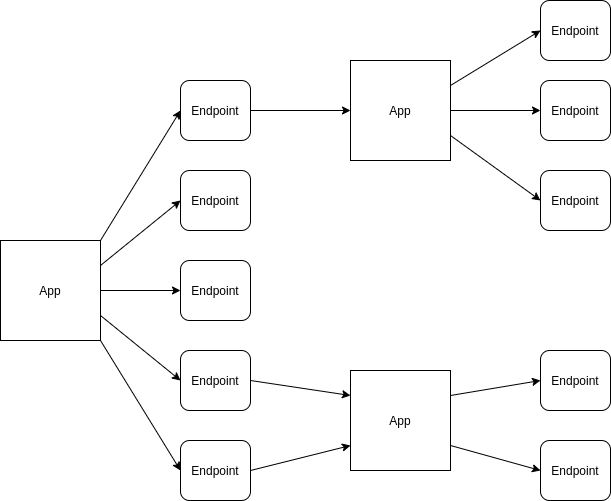

# Bamboo のコンセプト

## Bamboo の目的
Bamboo の目的は

1. API をコンポーネント化
2. 軽量で高速

の機能を備えた Web フレームワークを作ることです．これらについて順に説明していきます．

## API をコンポーネント化
現在，Python には多くの Web フレームワークがあります．有名どころだと

* Django
* Flask
* Bottle
* Falcon
* Hug
* Fast API

などがありますが，特に Django を除いたいわゆる軽量フレームワークは，1つのエンドポイントの作成に以下のような記法を採用しています (以下のコードは Flask の例です)．

```python
@app.route("/test")
def hello():
    return "Hello, World"
```

一方で，Bamboo ではエンドポイントを関数ではなくクラスとして作成します:

```python
@app.route("test")
class MockEndpoint(Endpoint):

    def do_GET(self) -> None:
        self.send_body(b"Hello, World")
```

このような簡単な実装だけ見ればコード量の差から Flask の記法の方がスッキリして見えますが，将来的に大規模な開発をしていく上では Bamboo の記法の方が概念的に優れています．なぜなら Bamboo ではエンドポイントをコンポーネント (部品) とみなしているからです．

より直感的に説明するために，ユーザーの画像を操作する API を考えてみましょう．ここでデータの対象は「画像」であり，作成する API は「画像」に対しての操作のリクエストに応答する必要があります．それならばエンドポイントもデータの操作にリンクした以下のような構造を持つほうが直感的です．

```python
@app.route("image")
class MockImageEndpoint(Endpoint):

    def do_GET(self) -> None:
        """画像の取得処理をする"""
        ...

    def do_DELETE(self) -> None:
        """画像の消去処理をする"""
        ...

    def do_POST(self) -> None:
        """画像の登録処理をする"""
        ...

    def do_PUT(self) -> None:
        """画像の変更処理をする"""
        ...
```

上記のコードは内部ロジックは全く実装されていませんが，クラスの構造を見ただけで API がどのような処理をするのか非常にわかりやすくなっています．もちろん，Bamboo でなくとも同様のロジックは実装できますが，1つのアーキテクチャパターンとして Bamboo のアーキテクチャは大規模開発での管理に向いた実装になっています．また，マイクロサービスを構築する際にもこのようなコンポーネント化は便利です．例えば，サーバーサイドで複数のサーバーマシンを内部のネットワークで接続させている場合のグラフは以下のように描くことが出来ます．



## 軽量で高速
bamboo はサーバーを明確に構造化することにより，重複する処理や不必要に重たい処理を省いています．その結果，軽量化に成功し，レスポンス速度も他のフレームワークと比較しても引けを取りません．[ベンチマーク結果](../../benchmark/http/RESULTS.md)を見ると一目瞭然です．bamboo の性能は高速なフレームワークとして知られる falcon と同等水準です．
